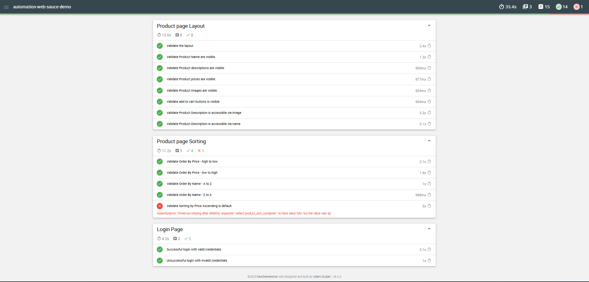
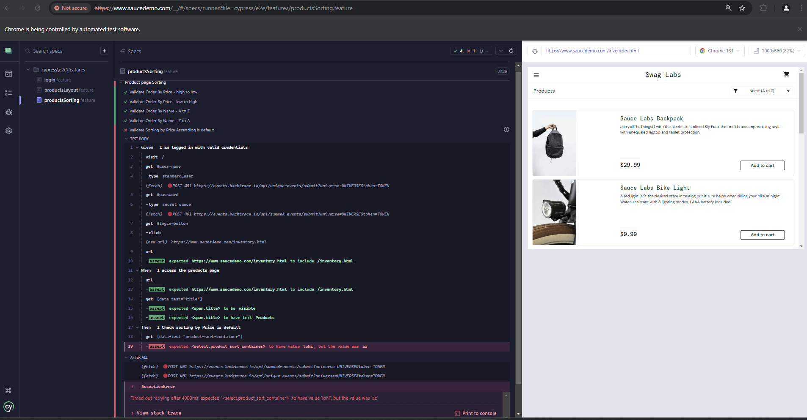
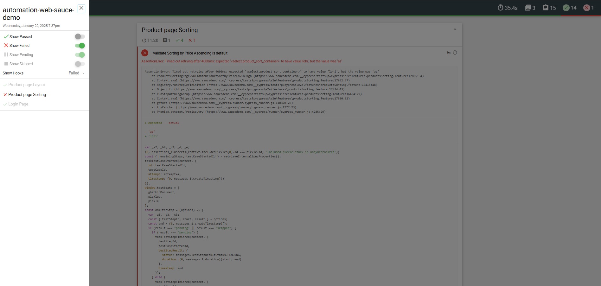

# This project is an automation of tests using Cypress with Cucumber for a Sauce Labs demo page.
https://www.saucedemo.com/
## Test Cases in Gherkin Format
### Login Page Test Cases
Feature: Login Page  

  Scenario: Verify input fields are visible and accessible
    Given I am on the login page
    When I check if Email input fields should be visible
    Then I check if Password input fields should be visible

  Scenario: Successful login with valid credentials  
    Given I am on the login page  
    When I enter valid email  
    And I enter valid password  
    And I click on the login button
    Then I should be redirected to the products page  

  Scenario: Unsuccessful login with invalid credentials  
    Given I am on the login page  
    When I enter invalid email    
    And I enter invalid password  
    And I click on the login button  
    Then I should see an error message - Username and password do not match
  
  Scenario: Attempt login with only email
    Given I am on the login page  
    When I enter valid email  
    And I click on the login button
    Then I should see an error message - Password is required

  Scenario: Attempt login with only password
    Given I am on the login page  
    When I enter valid password  
    And I click on the login button
    Then I should see an error message - Username is required

  Scenario: Attempt login without email and password.
    Given I am on the login page  
    When I click on the login button
    Then I should see an error message - Username is required 

  Scenario: Attempt login with valid email but invalid password
    Given I am on the login page  
    When I enter valid email    
    And I enter invalid password  
    And I click on the login button  
    Then I should see an error message - Username and password do not match
    

### Products Page Test Cases(Layout)
Feature: Product page Layout

  Scenario: Validate the layout.  
    Given I am logged in with valid credentials  
    When I access the products page  
    Then Should ensure that the products layout is structured in a grid  

  Scenario: Validate Product Name are visible.  
    Given I am logged in with valid credentials  
    When I access the products page  
    Then Should ensure that all product names are visible  

  Scenario: Validate Product descriptions are visible.  
    Given I am logged in with valid credentials  
    When I access the products page  
    Then Should ensure that all product descriptions are visible  

  Scenario: Validate Product prices are visible.  
    Given I am logged in with valid credentials  
    When I access the products page  
    Then Should ensure that all prices are visible  

  Scenario: Validate Product images are visible.  
    Given I am logged in with valid credentials  
    When I access the products page  
    Then Should ensure that all product images are visible  

  Scenario: Validate add to cart buttons is visible.  
    Given I am logged in with valid credentials  
    When I access the products page  
    Then Should ensure that all add to cart buttons are visible  

  Scenario: Validate Product Description is accessible via image.  
    Given I am logged in with valid credentials  
    When I access the products page  
    Then I access Product Description via image  

  Scenario: Validate Product Description is accessible via name.  
    Given I am logged in with valid credentials  
    When I access the products page  
    Then I access Product Description via name  


### Products Page Test Cases(Sorting)
Feature: Product page Sorting

  Scenario: Validate Order By Price - high to low.  
    Given I am logged in with valid credentials  
    When I sort products by Price - high to low  
    Then The products should be sorted by price in descending order  

  Scenario: Validate Order By Price - low to high.  
    Given I am logged in with valid credentials  
    When I sort products by Price - low to high  
    Then The products should be sorted by price in ascending order  

  Scenario: Validate Order By Name - A to Z.  
    Given I am logged in with valid credentials  
    When I sort products by Name - A to Z  
    Then The products should be sorted by name in ascending order  

  Scenario: Validate Order By Name - Z to A.
    Given I am logged in with valid credentials  
    When I sort products by Name - Z to A  
    Then The products should be sorted by name in descending order  

  Scenario: Validate Sorting by Price Ascending is default.  
    Given I am logged in with valid credentials  
    When I access the products page  
    Then I Check sorting by Price is dedault  


### The directory structure is as follows:

```
automationWebSauceDemo/
├── cypress/                       
│   ├── e2e/                       
│   │   ├── features/              
│   │   │   ├── login.feature      
│   │   │   ├── productsLayout.feature 
│   │   │   └── productsSorting.feature 
│   ├── pages/                     
│   │   ├── loginPage.js           
│   │   ├── productsLayoutPage.js  
│   │   └── productsSortingPage.js 
│   ├── screenshots/   
│   ├── support/                   
│   │   ├── stepsDefinitions/      
│   │   │   ├── loginSteps.js      
│   │   │   ├── productsSortingSteps.js
│   │   │   └── productsSteps.js   
│   │   └── e2e.js                 
├── .gitignore                     
├── cypress.config.js              
├── cypress.env.json               
├── package.json                   
└── readme.md                      
```


### Folders descriptions

- **`e2e/features/`**:                 # Gherkin feature definition files
- **`pages/`**:                        # Page objects for tests
- **`screenshots/`**:                  # Print failed tests
- **`support/stepsDefinitions`**:      # Cucumber step definitions
- **`report`**:                        # Git ignore file
- **`.gitignore `**:                   # Git ignore file
- **`cypress.config.js`**:             # Cypress configuration file
- **`cypress.env.json`**:              # Cypress environment configuration file
- **`package.json`**:                  # Project dependencies and scripts
- **`readme.md`**:                     # This README file


## Libraries and Frameworks

- **@badeball/cypress-cucumber-preprocessor**: Integrates Cucumber with Cypress for Behavior-Driven Development (BDD) style testing.
- **@bahmutov/cypress-esbuild-preprocessor**: A fast bundler for Cypress tests using esbuild for improved performance during preprocessing.
- **cypress**: A popular end-to-end testing framework for web applications, providing tools for testing, running, and debugging tests.
- **del-cli**: A command-line tool for deleting files and folders, used to clean up directories during automation workflows.
- **esbuild**: A fast JavaScript bundler and minifier that helps with building and transforming code for testing purposes.
- **mochawesome**: A reporting tool that generates detailed HTML reports for Mocha-based tests.
- **mochawesome-merge**: Merges multiple Mochawesome JSON reports into a single combined report.
- **mochawesome-report-generator**: Generates HTML reports from Mochawesome JSON files for easy viewing and analysis.


### How to Run the Project
Follow the steps below to run the Cypress tests in the project.

### 1. Clone the Repository
```
git clone https://github.com/your-username/automation-web-sauce-demo.git
```
### 2. Install Dependencies
Navigate to the project directory and install the necessary dependencies:

```
npm install
```

### 3. Run Tests

To run the tests using Cypress with the graphical interface
````
npx cypress open
````


Run the tests using the following command:
````
npm run test
````

For running specific tags (e.g., @layout):
```
npm run test --env TAGS="@layout"
```

### 4. Generate Reports
Merge and generate the test reports:

````
npm run full-report
````



## Bug Report: Default Sorting by Name A-Z Instead of Price Ascending 
### Bug Description:
The default sorting on the products page is set to "Name: A-Z" instead of the expected "Price: Low to High". When users access the products page, the sorting is incorrectly applied to names alphabetically instead of by price. This issue causes the test to fail, as it does not match the expected behavior of sorting by price by default.

### Expected Behavior:
- The products should be sorted by price in ascending order ("Price: Low to High") by default.

### Actual Behavior:
- The products are sorted by name in alphabetical order ("Name: A-Z") by default, rather than by price.

### Steps to Reproduce:
1. Log in with valid credentials (username: `valid_username`, password: `valid_password`).
2. Navigate to the products page (`/inventory.html`).
3. Observe that the sorting dropdown is set to "Name: A-Z" by default.
4. Verify that the products are sorted by name instead of by price.

### Test Environment:
- **Operating System:** Windows 10
- **Browser:** Chrome 131.0.67

### Error Logs:

AssertionError: Timed out retrying after 4000ms: expected '<select.product_sort_container>' to have value 'lohi', but the value was 'az'
    at ProductsSortingPage.validateDefaultSortByPriceLowToHigh (https://www.saucedemo.com/__cypress/tests?p=cypress\e2e\features\productsSorting.feature:17835:34)
    at Context.eval (https://www.saucedemo.com/__cypress/tests?p=cypress\e2e\features\productsSorting.feature:17862:37)
    at Registry.runStepDefininition (https://www.saucedemo.com/__cypress/tests?p=cypress\e2e\features\productsSorting.feature:10415:48)
    at Object.fn (https://www.saucedemo.com/__cypress/tests?p=cypress\e2e\features\productsSorting.feature:17034:43)
    at runStepWithLogGroup (https://www.saucedemo.com/__cypress/tests?p=cypress\e2e\features\productsSorting.feature:16484:29)
    at Context.eval (https://www.saucedemo.com/__cypress/tests?p=cypress\e2e\features\productsSorting.feature:17030:62)
    at getRet (https://www.saucedemo.com/__cypress/runner/cypress_runner.js:118320:20)
    at tryCatcher (https://www.saucedemo.com/__cypress/runner/cypress_runner.js:1777:23)
    at Promise.attempt.Promise.try (https://www.saucedemo.com/__cypress/runner/cypress_runner.js:4285:29)

### Where to see failed tests
Cypress with the graphical interface




Report Mochawesome




